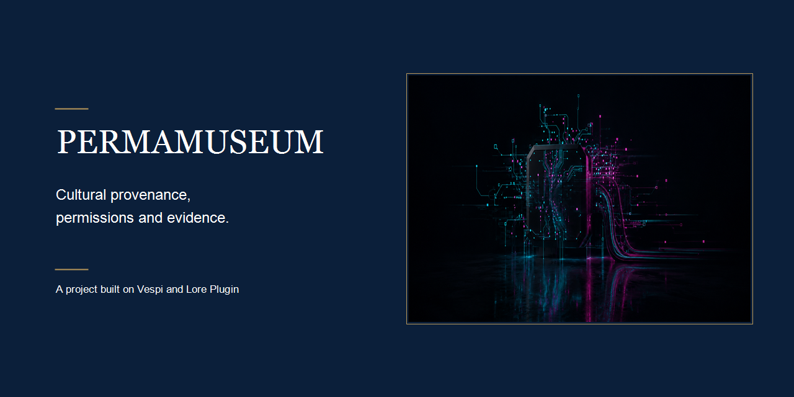

# Permamuseum

  
  
  
  
  

  <b>Permamuseum records who made a cultural provenance or use-permission claim, what evidence they named, and what an independent review actually covers.</b>

  <b>Do you build on Stellar, or are you judging Find Your Way or Meridian? Start here.</b> 
  Permamuseum is one of ten functional projects built on <a href="https://github.com/andresanemic/vespi">Vespi</a> with <a href="https://github.com/andresanemic/lore-plugin">Lore Plugin</a>.

  This repository contains the agreement, project notes and a summary of recorded evidence, not the source code. The code will open during the judges’ review period under a review-only license.

---

<b>Read in English</b>

**Permamuseum keeps claims, evidence, permissions, and review limits distinct.**

For the project model and the meaning of “verified,” see [How it works](./docs/HOW_IT_WORKS.md).

## Why

The design question is how to record provenance claims and use permissions so a reader can tell who said what, under whose authority, from which evidence, and with what limits. A single administrator’s “verified” label does not show how the decision was reached. A durable record cannot repair missing evidence or decide who owns a work, so Permamuseum records the claim and the boundary of its review instead of treating a label as truth.

## If you are judging Find Your Way or Meridian, start here

1. Read [How it works](./docs/HOW_IT_WORKS.md) for the project model and synthetic walkthrough.
2. Read [Evidence](./docs/EVIDENCE.md) for the recorded checks and their limits.
3. Read [Legal and limits](./docs/LEGAL_AND_LIMITS.md) for open legal questions and claims this project does not make.
4. Read [the token study](./docs/TOKEN.md) for the conditional PERMA concept and why it remains pending.
5. Check [Code not included](./CODE_NOT_INCLUDED.md) and the [review-only license](./LICENSE) for the code-opening plan and review terms.

## In one minute

See [How it works](./docs/HOW_IT_WORKS.md) for the fictional vessel walkthrough and [Evidence](./docs/EVIDENCE.md) for its recorded results.

## Why Permamuseum

For claims, reviews, permissions, and technical results, see [How it works](./docs/HOW_IT_WORKS.md) and [Evidence](./docs/EVIDENCE.md).

## What it is not

See [Legal and limits](./docs/LEGAL_AND_LIMITS.md) for what Permamuseum does not claim or establish.

## How it works

For the local record path and its actors and rules, see [How it works](./docs/HOW_IT_WORKS.md).

## Evidence you can open

See [Evidence](./docs/EVIDENCE.md) for the recorded suite, walkthrough, security results, and their limits. It also explains why the captured suite cannot be reproduced from this documentation-only repository and where to run it when the code opens.

## Permamuseum, Vespi and Lore Plugin

Permamuseum uses Vespi as the kernel in its local walkthrough, and Lore Plugin supplies the project’s criteria and routes work through them. See [Evidence](./docs/EVIDENCE.md) for kernel consumption and provenance checks.

## Economy and the PERMA study

See [the token study](./docs/TOKEN.md) for the RUC-D conclusion, conditions, and pending decisions.

## Limits and open questions

See [Legal and limits](./docs/LEGAL_AND_LIMITS.md), [Evidence](./docs/EVIDENCE.md), and [the token study](./docs/TOKEN.md) for the project’s limits, open legal questions, and claims not established by the records.

## Author

**Andrés Peña Mellado**, Digital Art Director & Creative Developer working across AI agents, Web3, design and research. Repository authority: `andresanemic`.

 &nbsp;&nbsp; [<picture><source media="(prefers-color-scheme: dark)" srcset="./assets/icons/v2/x-dark.svg"></picture>](https://x.com/andresanemic) &nbsp;&nbsp; 

---

[How it works](./docs/HOW_IT_WORKS.md) · [Evidence](./docs/EVIDENCE.md) · [Token study](./docs/TOKEN.md) · [Legal and limits](./docs/LEGAL_AND_LIMITS.md) · [Code not included](./CODE_NOT_INCLUDED.md) · [Review-only license](./LICENSE) · [Vespi](https://github.com/andresanemic/vespi) · [Lore Plugin](https://github.com/andresanemic/lore-plugin)

<b>Leer en español</b>

**Permamuseum mantiene separadas las afirmaciones, la evidencia, los permisos y los límites de una revisión.**

Para conocer el modelo del proyecto y el sentido de «verificado», consulta [Cómo funciona](./docs/HOW_IT_WORKS.md).

## Por qué

La pregunta de diseño es cómo registrar afirmaciones de procedencia y permisos de uso para que quien lee pueda saber quién dijo qué, bajo qué autoridad, con qué evidencia y con qué límites. La etiqueta «verificado» de una sola persona administradora no muestra cómo se tomó la decisión. Un registro durable no corrige la falta de evidencia ni decide quién es dueño de una obra; por eso Permamuseum registra la afirmación y los límites de la revisión en vez de tratar una etiqueta como verdad.

## Si estás evaluando Find Your Way o Meridian, empieza aquí

1. Lee [Cómo funciona](./docs/HOW_IT_WORKS.md) para conocer el modelo del proyecto y el recorrido sintético.
2. Lee [Evidencia](./docs/EVIDENCE.md) para ver las comprobaciones registradas y sus límites.
3. Lee [Marco legal y límites](./docs/LEGAL_AND_LIMITS.md) para conocer las preguntas jurídicas abiertas y las afirmaciones que este proyecto no hace.
4. Lee [el estudio del token](./docs/TOKEN.md) para conocer la idea condicional de PERMA y por qué sigue pendiente.
5. Revisa [Código no incluido](./CODE_NOT_INCLUDED.md) y la [licencia de solo revisión](./LICENSE) para conocer el plan de apertura y las condiciones de revisión.

## En un minuto

Consulta [Cómo funciona](./docs/HOW_IT_WORKS.md) para leer el recorrido de la vasija ficticia y [Evidencia](./docs/EVIDENCE.md) para ver sus resultados registrados.

## Por qué Permamuseum

Para conocer las afirmaciones, revisiones, permisos y resultados técnicos, consulta [Cómo funciona](./docs/HOW_IT_WORKS.md) y [Evidencia](./docs/EVIDENCE.md).

## Qué no es

Consulta [Marco legal y límites](./docs/LEGAL_AND_LIMITS.md) para saber qué no afirma ni establece Permamuseum.

## Cómo funciona

Consulta [Cómo funciona](./docs/HOW_IT_WORKS.md) para ver el recorrido local, sus actores y sus reglas.

## Evidencia que puedes abrir

Consulta [Evidencia](./docs/EVIDENCE.md) para ver la suite registrada, el recorrido, los resultados de seguridad y sus límites. También explica por qué este repositorio documental no puede reproducir la suite registrada y dónde ejecutarla cuando se abra el código.

## Permamuseum, Vespi y Lore Plugin

Permamuseum usa Vespi como kernel en su recorrido local, y Lore Plugin aporta los criterios del proyecto y encamina el trabajo según ellos. Consulta [Evidencia](./docs/EVIDENCE.md) para saber cómo se consume el kernel y qué comprueban las pruebas de procedencia.

## Economía y estudio de PERMA

Consulta [el estudio del token](./docs/TOKEN.md) para conocer la conclusión de RUC-D, las condiciones y las decisiones pendientes.

## Límites y preguntas abiertas

Consulta [Marco legal y límites](./docs/LEGAL_AND_LIMITS.md), [Evidencia](./docs/EVIDENCE.md) y [el estudio del token](./docs/TOKEN.md) para conocer los límites del proyecto, las preguntas jurídicas abiertas y lo que no establecen los registros.

## Autor

**Andrés Peña Mellado**, Digital Art Director & Creative Developer que trabaja entre agentes de IA, Web3, diseño e investigación. Autoridad del repositorio: `andresanemic`.

 &nbsp;&nbsp; [<picture><source media="(prefers-color-scheme: dark)" srcset="./assets/icons/v2/x-dark.svg"></picture>](https://x.com/andresanemic) &nbsp;&nbsp; 

---

[Cómo funciona](./docs/HOW_IT_WORKS.md) · [Evidencia](./docs/EVIDENCE.md) · [Estudio del token](./docs/TOKEN.md) · [Marco legal y límites](./docs/LEGAL_AND_LIMITS.md) · [Código no incluido](./CODE_NOT_INCLUDED.md) · [Licencia de solo revisión](./LICENSE) · [Vespi](https://github.com/andresanemic/vespi) · [Lore Plugin](https://github.com/andresanemic/lore-plugin)

